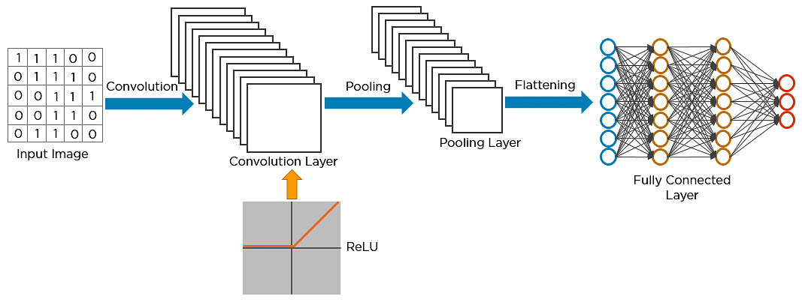
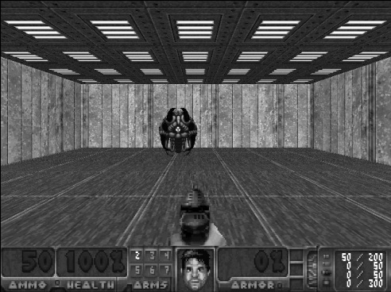
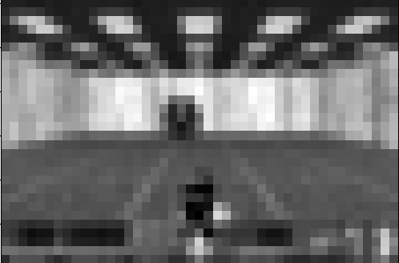

# Module-2-Implementation-CNN



## 🎮 Réseau de neurones de convolution – Convolution Neural Network (CNN)

Ces réseaux reposent sur des **filtres de convolution** (matrices numériques). Les filtres sont appliqués aux entrées avant que celles-ci ne soient transmises aux neurones. Ces réseaux de neurones sont particulièrement utiles pour le traitement et la prévision d'images. 


### 🖼️ La Résolution des Images dans Doom

Avant tout, quand on parle d'image, il faut directement penser à sa résolution. Quelle résolution avons-nous besoin pour jouer à Doom avec une IA ?

<div style="display:flex; flex-direction:row">
    
    
</div>
Pour la première image, la résolution est bien trop élevée. L'image contient beaucoup trop de détails inutiles et n'a pas nécessairement besoin d'afficher le nombre de balles restantes, la vie, la sélection d'arme, ainsi que tout le reste. Une réduction du nombre de pixels a été appliquée, permettant aux éléments principaux de ressortir clairement à l'œil nu.

### 🔍 Comment les CNN Comprennent les Images


Pour que l'IA puisse comprendre les éléments visuels présents dans l'image, des filtres sont appliqués à chaque couche de convolution. Ces filtres permettent d'extraire des informations importantes, comme les **contours**, les **formes** ou les **textures**.

Chaque couche de convolution applique trois transformations principales à l'image :

1. **Passage à travers la couche `conv2d`**, qui effectue une opération de convolution sur l'image.
2. **Normalisation des données via `BatchNorm2d`**, ce qui permet de stabiliser et accélérer l'entraînement en réduisant les problèmes de variance.
3. **Application de la fonction d'activation `ReLU`** pour introduire de la non-linéarité et mieux représenter les relations complexes dans les données.

### 🔄 Processus de Convolution

Par exemple, dans ce réseau, après la première couche `conv1`, les dimensions de l'image sont réduites, mais ses caractéristiques principales sont conservées et mises en avant. Ce processus se répète pour les couches suivantes (`conv2`, `conv3`, etc.), permettant au réseau de mieux comprendre des détails de plus en plus abstraits.

### ⚙️ Après les Couches de Convolution


Après les couches de convolution, deux autres composants importants interviennent :

- **`State_fc`** : Cette partie du réseau est responsable de capturer l'état global de l'image et de le traduire en une représentation plus compacte.
- **`Advantage_fc`** : Cette section est dédiée à évaluer l'"avantage" relatif de chaque action possible dans l'état actuel.

La sortie finale combine ces deux informations pour produire les **valeurs Q (Q-values)**, qui indiquent la qualité de chaque action possible dans le contexte actuel.

---

## 🎮 Utilisation de Gymnasium pour l'IA de Doom

Dans ce projet, nous utilisons **Gymnasium** (anciennement OpenAI Gym) pour créer un environnement d'entraînement pour l'IA. Gymnasium est une bibliothèque populaire permettant de simuler des environnements dans lesquels les IA peuvent être testées et entraînées. Nous avons choisi de tester notre modèle sur l'environnement **Doom**, un jeu vidéo où l'IA doit naviguer dans un monde complexe en prenant des décisions pour survivre.

### 🕹️ L'Environnement Doom

**Doom** est un jeu vidéo de type FPS (First Person Shooter), où l'agent (l'IA) doit se déplacer dans un environnement, éviter les ennemis, collecter des objets et réussir des missions. C'est un environnement parfait pour tester l'apprentissage par renforcement.

Grâce à **Gymnasium**, il est facile de connecter notre modèle d'IA à l'environnement Doom et de l'entraîner à l'aide de réseaux de neurones convolutifs (CNN).

---

## 🧑‍💻 Code & Installation

Pour entraîner l'IA à jouer à Doom avec un **CNN**, voici les étapes et le code à suivre :

### 1. Installation des dépendances

Vous devez d'abord installer **Gymnasium** et ses dépendances pour pouvoir utiliser l'environnement Doom :

```bash
pip install gymnasium
pip install "gymnasium[atari]"
